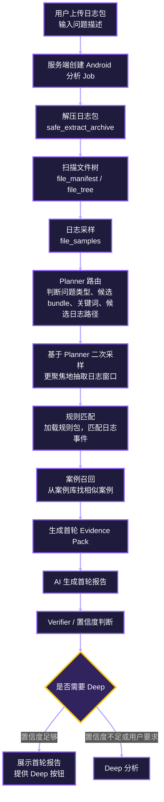
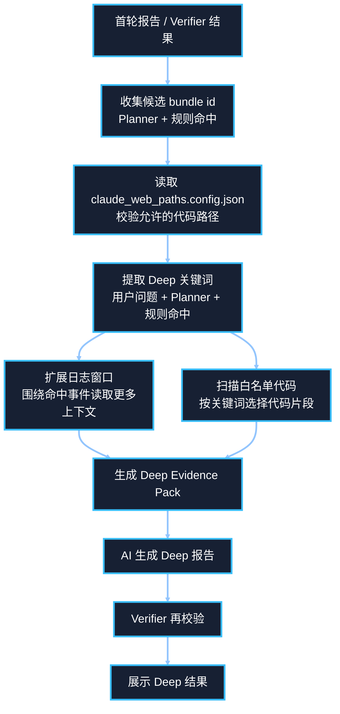
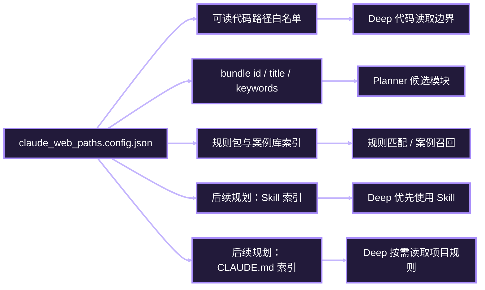

# Android 分析当前架构说明

这份文档用通俗语言描述当前 Android 问题分析功能的工作方式，重点说明首轮工作流、Deep 分析、规则包、本地代码、Skill 和 `claude_web_paths.config.json` 之间的关系。

## 一句话理解

当前 Android 分析不是直接让 AI 读取整个日志包和整个代码库，而是先由服务端工具完成解压、文件识别、日志采样、Planner 路由、规则匹配和案例召回，再把整理后的证据包交给 AI 生成报告。

首轮工作流偏“低成本、受控、快速”：AI 主要看到过滤后的日志证据、规则命中、案例卡片和 bundle 摘要。

Deep 分析偏“扩大证据范围”：服务端会根据首轮结果，在 `claude_web_paths.config.json` 白名单限制下读取相关代码片段，再把扩展日志、代码片段和首轮报告整理成 Deep Evidence Pack 交给 AI。

## 总体流程

## 首轮工作流里 AI 能看到什么

首轮 AI 不是直接读取本地项目代码，也不是直接加载本地 Skill。

它主要看到这些内容：

| 输入 | 来源 | 用途 |
|---|---|---|
| 用户问题 | 前端表单 | 判断用户关心的问题现象 |
| 文件树摘要 | 解压后的日志包 | 判断日志包里有哪些文件类型 |
| 日志采样 | 解压后的日志包 | 提供少量代表性日志片段 |
| bundle 摘要 | Android 知识库 / `claude_web_paths.config.json` 相关配置 | 判断可能涉及哪个模块 |
| Planner 输出 | AI 或 fallback Planner | 给后续采样和规则匹配提供方向 |
| 规则命中 | 规则包扫描结果 | 提供结构化证据 |
| 案例卡片 | 本地案例库 | 提供相似历史问题参考 |
| Evidence Pack | 服务端整理结果 | 首轮报告的主要依据 |

也就是说，首轮 AI 当前拿不到完整本地代码目录，也不会自动执行项目 Skill。它更像是在看一份经过工具过滤后的“问题首轮卷宗”。

## 首轮工作流里本地代码和 Skill 的状态

| 能力 | 首轮状态 | 说明 |
|---|---|---|
| 本地代码读取 | 默认不读取 | 首轮不会把白名单代码目录直接交给 AI |
| Skill 加载 | 默认不加载 | 当前 Android 首轮流程没有把 Skill 作为 Claude CLI 的 Skill 目录注入 |
| CLAUDE.md 加载 | 默认不加载 | 首轮没有按 bundle 自动读取代码路径下的 `CLAUDE.md` |
| 规则包 | 会使用 | 服务端规则引擎会读取 Android 知识库里的规则 |
| 案例库 | 会使用 | 首轮会召回相似案例卡片 |
| `claude_web_paths.config.json` | 间接使用 | 主要用于 bundle/路径能力索引，首轮不直接开放代码读取 |

这也是当前首轮分析速度和成本可控的原因，但缺点是遇到需要理解项目代码、厂商定制逻辑、目录规则或 Skill 工作流的问题时，首轮容易只停留在日志和规则层面。

## Deep 分析当前流程

Deep 当前已经能在白名单限制下读取代码片段，但还没有完整做到：

- 优先使用命中的 Skill 工作流。
- 按需读取命中代码路径下的 `CLAUDE.md`。
- 基于 Profile 加载不同类型问题的专用排查策略。
- 把历史案例按问题类型、模块、证据源做更细的对比。
- 在低置信度时让 AI 按明确升级策略扩展关键词，而不是自由发散。

## `claude_web_paths.config.json` 当前和后续的定位

当前它主要承担“能力白名单”和“bundle 索引”的角色：

后续更理想的设计是：`claude_web_paths.config.json` 不只是路径列表，而是每个 bundle 的能力入口。它告诉系统：

- 哪些代码目录可以被读取。
- 哪些日志规则包属于这个模块。
- 哪些 Skill 与这个模块或问题类型相关。
- 哪些 `CLAUDE.md` 可以在命中时按需读取。
- 哪些历史案例或经验文档可以召回。

## 计划中的 Deep 优先级

后续 Deep 分析建议按下面的顺序升级，不要一开始就让 AI 漫无目的 grep：

1. 先使用命中的 Profile Skill 和模块 Skill。
2. 如果没有相关 Skill，再使用规则包里的日志 tag、服务名、包名、类名、方法名去过滤日志和代码。
3. 再结合白名单代码路径和命中的 `CLAUDE.md` 理解日志语义、业务流程和代码实现。
4. 如果仍然没有高置信度结论，再允许 AI 基于用户描述、首轮证据和上下文发散生成新的错误关键词。
5. 新关键词仍然必须在白名单日志和白名单代码范围内执行，所有扩展都要记录到 debug trace。

## 当前架构的优缺点

优点：

- 首轮分析速度较快，成本可控。
- 不会轻易把整个本地代码库或全部日志丢给 AI。
- 规则命中、案例召回、AI 报告和 Verifier 分层清晰。
- Deep 代码读取已经受 `claude_web_paths.config.json` 白名单约束。

不足：

- 首轮 AI 对本地代码和 Skill 的利用很弱。
- Deep 还缺少明确的 Skill / CLAUDE.md / 案例优先级。
- 问题类型 Profile 还没有成为一等公民。
- 对 FWK、厂商定制代码、XTS、性能、内存等复杂场景，仍需要继续建设 Profile 和 Evidence Parser。
